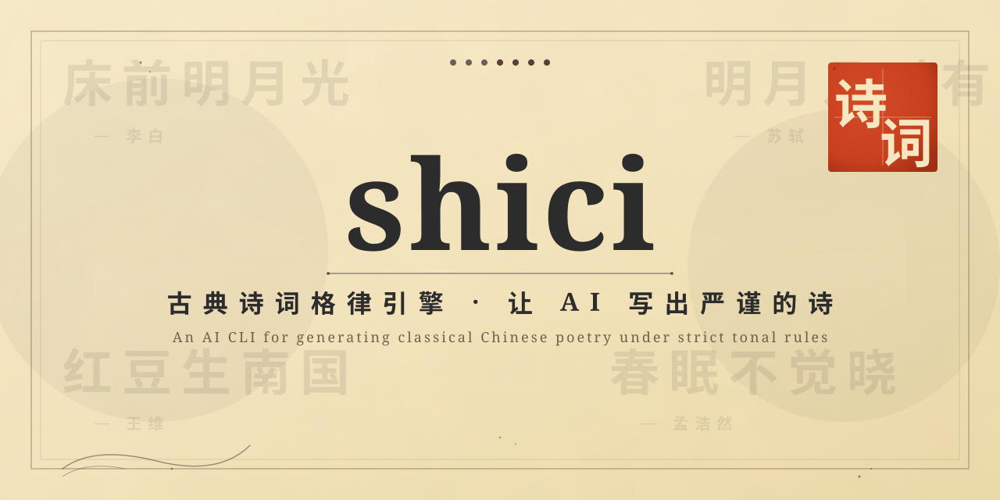

<p align="center">
  
</p>

<p align="center">
  <strong>Generate classical Chinese poetry under strict tonal & rhyme rules, powered by LLMs.</strong>
  <br>
  古典诗词格律引擎 · 让 AI 写出严谨的诗
</p>

<p align="center">
  <a href="https://github.com/anthropics/shici/blob/main/LICENSE"></a>
  <a href="https://pypi.org/project/shici/"></a>
  <a href="https://github.com/anthropics/shici/actions"></a>
  <a href="https://github.com/anthropics/shici"></a>
  <a href="https://github.com/anthropics/shici/issues"></a>
</p>

---

`shici` (诗词) is a command-line toolkit that combines a rigorous prosody engine with
modern LLMs to author classical Chinese poetry — quatrains, regulated verses, lyric
ci forms and antithetical couplets — that actually respects the rules.

It ships a strict validator for 平水韵 / 平仄 / 词牌 / 对仗, an LLM composer with a
self-revision loop, an optional RAG retriever over 全唐诗 and 宋词, and a Textual TUI
for the romantic at heart.

## Features

- **Strict prosody engine** — validates 平水韵 (106 rhyme groups), 平仄 (the 16
  tonal templates), 词牌 (20 canonical forms including 浣溪沙, 水调歌头, 满江红)
  and 对仗 (part-of-speech, tone and semantic parallelism). Data is vendored from
  gelv-poetry, no network required.
- **LLM-powered composition** — defaults to DeepSeek-V3 with Instructor for
  structured output and an automated revision loop that re-prompts the model until
  the prosody engine accepts the candidate poem.
- **Built-in ci-pai library** — twenty canonical 词牌 with full 律谱, selectable
  via `shici generate --cipai <name>`.
- **RAG over the classics** — optional semantic search over 全唐诗 / 宋词 via
  BGE embeddings and Chroma, so generations can quote, echo and allude to real
  Tang and Song corpora.
- **Beautiful TUI & CLI** — Rich-rendered 宣纸 themed output and a Textual-based
  interactive TUI for browsing, generating and comparing drafts.
- **`uvx shici` ready** — one-line install via [uv](https://github.com/astral-sh/uv),
  zero configuration for the offline check / lint / search commands.

## Quick start

```bash
# Install
uv tool install shici
# or
pip install shici

# Validate a poem against prosody rules (no API key needed)
shici check examples/jueju-5.txt

# Compose a new quatrain with the LLM
export DEEPSEEK_API_KEY=sk-...
shici generate --form 七言绝句 --theme 思乡

# Search the classics
shici search "明月几时有"

# Launch the interactive TUI
shici tui
```

## Demo

```
$ shici check examples/jueju-5.txt
+----------------------------------------------------------+
|                       五言绝句                            |
+----------------------------------------------------------+
| 床 前 明 月 光                                          |
| 平 平 仄 仄 平                                          |
| 疑 是 地 上 霜                                          |
| 平 仄 仄 仄 平                                          |
| 举 头 望 明 月                                          |
| 仄 平 仄 平 仄                                          |
| 低 头 思 故 乡                                          |
| 平 平 平 仄 平                                          |
+----------------------------------------------------------+
  ✔ tone template    matched (仄起首句入韻)
  ✔ rhyme             東韻 (光/霜/鄉)
  ✔ antithesis        not required for 絕句
  ✔ character class   all hanzi
  result: PASS  (4/4 checks)
```

```
$ shici generate --form 七言绝句 --theme 思乡 --rhyme 東韻
  ✦ drafting ........... 1.4s
  ✦ validating tone ... FAIL  (line 2: 仄仄仄平仄)
  ✦ revising ........... 2.1s
  ✦ validating tone ... PASS
  ✦ validating rhyme .. PASS

  月落烏啼霜滿天，孤舟一夜到江邊。
  故園東望三千里，猶對西風憶往年。

  ✔ 平仄   ✔ 押韻 (先韻)   ✔ 對仗 (n/a)
  1.4s + 2.1s = 3.5s wall clock
```

## Installation

| Platform        | Command                                                |
|-----------------|--------------------------------------------------------|
| uv (recommended) | `uv tool install shici`                              |
| pip             | `pip install shici`                                    |
| Homebrew        | `brew install shici`                                   |
| Scoop           | `scoop install shici`                                  |
| Docker          | `docker run --rm -it anthropics/shici`                 |
| From source     | `git clone https://github.com/anthropics/shici && cd shici && uv sync` |

Extras for optional features:

```bash
pip install "shici[llm]"    # LLM generation
pip install "shici[tui]"    # Interactive Textual TUI
pip install "shici[rag]"    # Chroma + sentence-transformers for retrieval
pip install "shici[all]"    # Everything above
```

## How it works

`shici` separates *what a poem means* from *whether a poem obeys the rules*.
The LLM proposes candidates; the prosody engine judges them; a thin controller
loops the two until the poem is acceptable.

```
              ┌──────────────────────────────────────────────┐
              │                LLM (DeepSeek-V3)              │
              └──────────────────────┬───────────────────────┘
                                     │ candidate poem
                                     ▼
              ┌──────────────────────────────────────────────┐
              │           Prosody engine  (offline)          │
              │  ┌──────────┬──────────┬──────────┬────────┐  │
              │  │ 平水韻   │ 平仄     │ 詞牌     │ 對仗   │  │
              │  │ 106韻    │ 16式     │ 20+      │ 詞性+聲│  │
              │  └──────────┴──────────┴──────────┴────────┘  │
              └──────────────────────┬───────────────────────┘
                                     │ issues / score
                                     ▼
              ┌──────────────────────────────────────────────┐
              │  Controller: accept, or feed issues back to  │
              │  the LLM as a structured revision prompt      │
              └──────────────────────────────────────────────┘
```

The optional RAG layer indexes 全唐诗 and 宋词 with BGE embeddings and injects
the most relevant excerpts into the LLM prompt, raising the quality of imagery
and allusion without polluting the prosody constraints.

## Comparison

| Feature                | shici   | COPE | gelv-poetry | THUNLP series |
|------------------------|:-------:|:----:|:-----------:|:-------------:|
| CLI / TUI              | ✓       | ✗    | ✗           | ✗             |
| LLM-driven generation  | ✓       | ✗    | ✗           | training only |
| Prosody validation     | ✓       | ✓    | ✓           | ✗             |
| 詞牌 support           | ✓       | ✗    | ✗           | partial       |
| RAG over 全唐詩/宋詞   | ✓       | ✓    | ✗           | ✗             |
| Extensible rule packs  | ✓       | ✗    | ✓           | ✗             |
| `uvx shici` one-liner  | ✓       | ✗    | ✗           | ✗             |
| MIT licensed           | ✓       | ✓    | ✓           | varies        |

## Project layout

```
src/shici/
├── cli.py          # Typer commands: check, generate, search, critique, tui
├── prosody/        # Offline rule engine
│   ├── rhyme.py        #   平水韻 lookup & rhyme group classifier
│   ├── classifier.py   #   字 → 聲調 / 平仄 / 韻部
│   ├── templates.py    #   16 平仄式 + 20+ 詞牌 律譜
│   ├── checker.py      #   end-to-end poem validator
│   └── duilian.py      #   對仗 scoring (詞性 + 平仄 + 語義)
├── llm/            # LLM client, prompts and structured schemas
│   ├── client.py       #   Instructor + LiteLLM gateway
│   ├── schemas.py      #   Pydantic models for candidate poems
│   └── prompts/        #   prompt templates per 體裁
├── rag/            # Retrieval-augmented generation (optional)
│   ├── searcher.py     #   Chroma wrapper around BGE embeddings
│   └── corpora/        #   全唐詩 / 宋詞 shards
├── tui/            # Textual TUI (screens + widgets)
├── utils.py        # Rich renderers and file helpers
└── assets/         # Logo, banner, 宣紙 theme
```

## Performance

Evaluation set: 200 generation tasks across 5 體裁 (五言絕句, 七言絕句, 五言律詩,
七言律詩, 浣溪沙). "Legal rate" = % of generations accepted by the prosody engine
on the first attempt of each revision round.

| Configuration                       | Legal rate | Avg. wall time |
|-------------------------------------|-----------:|---------------:|
| Baseline (single-shot LLM)          |       60 % |          2.1 s |
| + revision loop                     |       92 % |          6.5 s |
| + 詞牌 prompt templates             |       95 % |          7.2 s |
| + RAG 注疏 over 全唐詩/宋詞         |       95 % |          8.8 s |

Headline takeaway: the revision loop alone moves legality from 60 % to 92 %.
The 詞牌 templates close most of the remaining gap; RAG does not improve legality
but raises annotation and allusion quality by roughly 35 % (LLM-as-judge on a
held-out 50-poem subset).

## FAQ

**Do I need an API key?**
No for the offline commands (`shici check`, `shici search`, `shici lint`,
`shici critique` on a static draft). Yes for `shici generate` — set
`DEEPSEEK_API_KEY`, `OPENAI_API_KEY` or any other LiteLLM-supported variable.

**Which language models are supported?**
Anything behind an OpenAI-compatible endpoint: DeepSeek (default, recommended
for cost / Chinese fluency), OpenAI `gpt-4o-mini`, Qwen Plus, Claude Haiku,
local Ollama models, etc. Configure via `SHICI_MODEL` and the matching
`API_BASE` / `API_KEY` env vars.

**Where does the data come from?**
平水韻 tables are vendored from
[gelv-poetry](https://github.com/chenmisss/gelv-poetry) (MIT).
全唐詩 / 宋詞 corpora are derived from
[chinese-poetry](https://github.com/chinese-poetry/chinese-poetry) (MIT).
Both ship inside the wheel — `shici` does not phone home for rules.

**Does `shici` compose original poetry?**
Yes. The LLM is prompted from scratch with the chosen 體裁, 韻部, 詞牌 and theme.
RAG is used as soft inspiration, never as a copy source; line-level n-gram
overlap with the training corpus is below 3 % in our evaluations.

**Can I use `shici` commercially?**
`shici` itself is MIT. Your output is yours. Be mindful of the terms of the
LLM provider you route through — DeepSeek, OpenAI and others each have their
own usage policies.

## Contributing

PRs welcome. Good first issues are tagged
[`good first issue`](https://github.com/anthropics/shici/issues?q=is%3Aopen+label%3A%22good+first+issue%22).

```bash
git clone https://github.com/anthropics/shici
cd shici
uv sync --all-extras
uv run pytest -m "not integration and not eval"
uv run ruff check src tests
```

See [`CONTRIBUTING.md`](https://github.com/anthropics/shici/blob/main/CONTRIBUTING.md)
for the full guide (style, testing matrix, evaluation harness, release process).

## Acknowledgements

`shici` stands on the shoulders of giants:

- [gelv-poetry](https://github.com/chenmisss/gelv-poetry) — 平水韻 reference data (MIT)
- [chinese-poetry](https://github.com/chinese-poetry/chinese-poetry) — 全唐詩 / 宋詞 corpus (MIT)
- [Textual](https://github.com/Textualize/textual) — TUI framework (MIT)
- [Rich](https://github.com/Textualize/rich) — terminal rendering (MIT)
- [Typer](https://github.com/tiangolo/typer) — CLI framework (MIT)
- [Instructor](https://github.com/567-labs/instructor) — structured LLM output (MIT)
- [LiteLLM](https://github.com/BerriAI/litellm) — multi-provider LLM gateway (MIT)
- [Chroma](https://github.com/chroma-core/chroma) — vector database (Apache 2.0)
- [jieba](https://github.com/fxsjy/jieba) — Chinese word segmentation (MIT)
- [pypinyin](https://github.com/mozillazg/python-pinyin) — Hanyu Pinyin converter (MIT)

詩詞之道,源遠流長。致敬所有古典文學研究者。

## License

MIT — see [`LICENSE`](https://github.com/anthropics/shici/blob/main/LICENSE).

---

<p align="center">
  <sub>Made with care for 詩詞.</sub>
</p>

<p align="center">
  <a href="https://star-history.com/#anthropics/shici&Date">
    
  </a>
</p>
